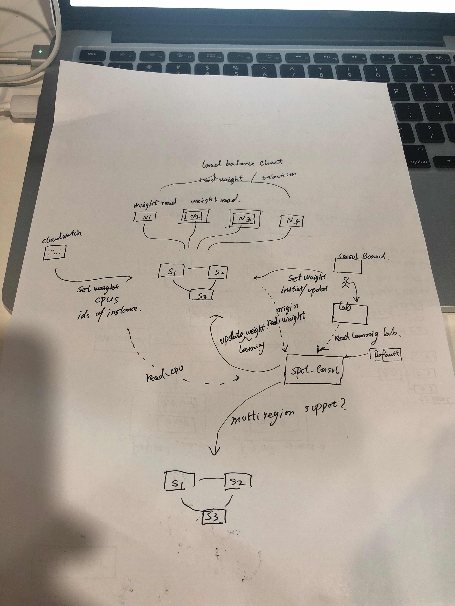
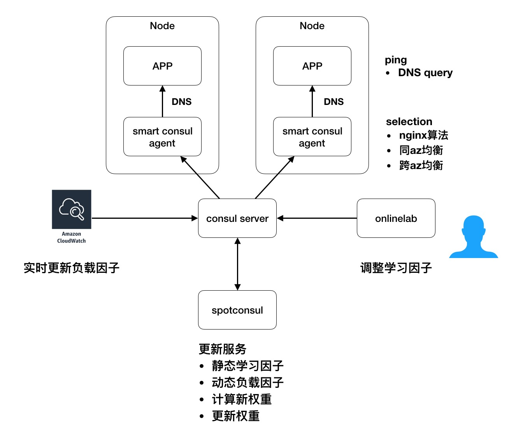
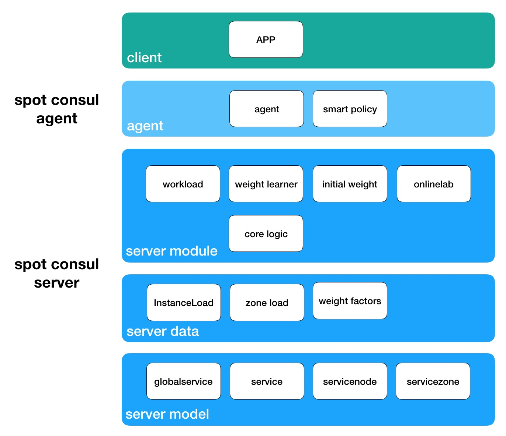

# spot-consul
基于consul的，在aws竞价实例、弹性伸缩组环境下，自适应负载均衡实现方案。

# 背景
当前的负载均衡有以下几大卖点：
1. 权重自适应学习
2. 在线策略控制
3. 客户端Nginx权重选择算法

但存在几个问题，相对于服务端学习控制讲：
1. 学习放在客户端，每种语言客户端实现就得重新实现一遍
2. 容易引起客户端的共振，且共振的解决不如服务端控制力强
3. 客户端复杂带来一些锁和开销
4. 负载均衡的算法升级需要客户端升级，而客户端集成到业务系统里，业务系统还需要升级，这是不太现实的

# 目标
* 实现服务端权重控制
* 重写consul客户端，c++/golang版本

# 开放性目标-客户端透明
## 客户SDK方式
如当前线上以及上述设计即为客户端sdk方式，提供给客户一份含有随机算法的sdk，客户通过api选择一个ip做请求。

## 服务端方式
客户不需要引入任何的sdk，只需要connect("service-name.consul.com")，即可获取到dns解析ip进行直连
* 客户端能否替代consul agent，这样对于用户角度只需要面向一个DNS，用户获得哪个IP是均衡算法透明的，最大限度减少了用户侧的集成
* 如果不能替代consul agent那要提供额外的dns server，这个server同agent并存，可能给用户感觉部署监控复杂的印象

# 设计草图

# 部署框图

# 模块图

